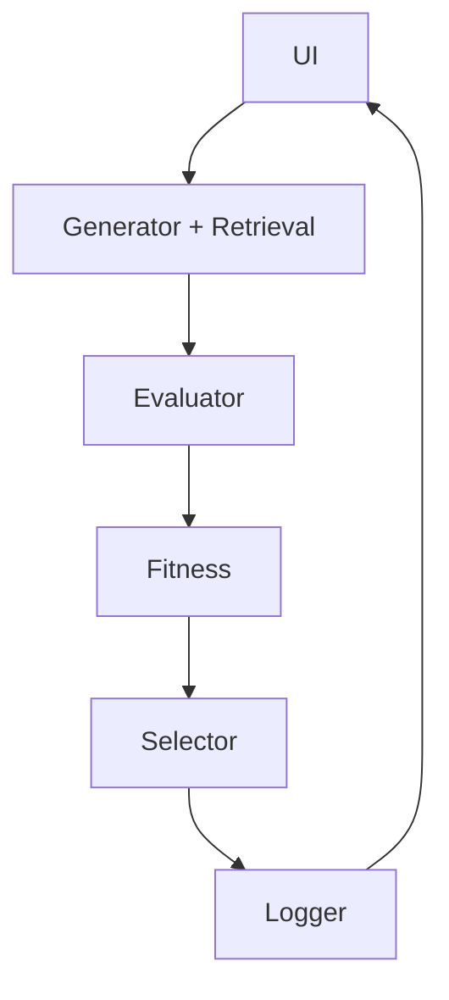

# System Architecture (High Level)

## Main Components

- **UI**: User selects experiment mode, parameters, and views results (plots, best code).
- **Candidate Generator**: Produces new code candidates via mutations (random, template, or LLM with retrieval).
- **Retrieval Module (Local)**: Searches vector database for relevant code examples/templates to guide LLM mutations.
- **Evaluator**: Executes candidates in Pacman simulator, returns metrics (score, survival_time, steps).
- **Fitness Function**: Aggregates metrics into fitness score (weighted sum).
- **Selector**: Chooses top-k candidates for next generation.
- **Logger**: Records fitness history, plots, and final outputs.

## Data Flow

1. UI collects user inputs (baseline code, generations, mode).
2. Generator creates candidates; Retrieval provides context for LLM mode.
3. Evaluator runs simulations.
4. Fitness computes scores.
5. Selector updates population.
6. Logger outputs results to UI.

## Architecture Diagram (Mermaid)

## Key Interfaces

- Generator: `generate_candidates(parents, mode) -> List[Candidate]`
- Evaluator: `evaluate(candidate) -> Metrics`
- Fitness: `compute_fitness(metrics, weights) -> float`
- Retrieval: `search(query) -> List[RelevantDocs]`
